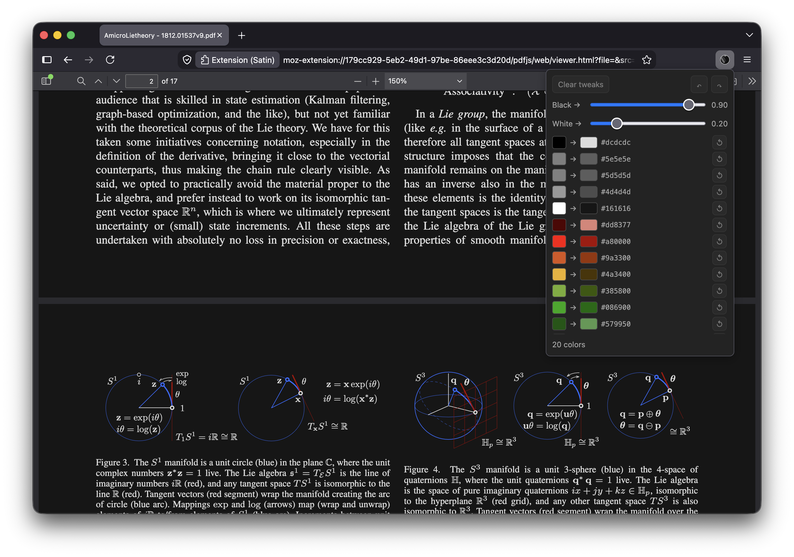

<div align="center"></div>
<h1 align="center">Satin Reader</h1>

A browser extension to manipulate the colors of a PDF in real time while reading it. Two sliders let you easily define an affine transformation on the perceptual lightness dimension of the [Oklab color space](https://en.wikipedia.org/wiki/Oklab_color_space), e.g. to achieve dark mode with better contrast and more faithful colors than simply inverting the colors would achieve. Then all unique colors in the document can be further tweaked individually if desired.



## Building

```sh
./build.sh                           # writes satin.xpi
UNPACKED_DIR=./satin-dir ./build.sh  # …and an unpacked copy, for Chrome
```

One archive covers both engines. The manifest declares `background.scripts` for
Firefox and `background.service_worker` for Chrome, and each browser ignores the
other's key ([documented and recommended by
Mozilla](https://developer.mozilla.org/en-US/docs/Mozilla/Add-ons/WebExtensions/manifest.json/background)),
so the `.xpi` is a plain zip that also loads in Chrome, Edge, Brave, Vivaldi and
Opera. Chrome's "Load unpacked" wants a directory rather than an archive, which
is what `UNPACKED_DIR` is for.

Needs only `bash`, `curl`, `unzip`, `zip` and `patch`. The script downloads the
prebuilt [pdf.js](https://mozilla.github.io/pdf.js/) viewer, applies
`pdfjs-viewer-html.patch` to it and zips the result, so there is no npm build.
With Nix, `nix build` runs the same script and puts the XPI under
`result/share/mozilla/extensions/`.

### The logo

The logo is `logo/satin.svg`, a folded satin ribbon. It is written by
`logo/render.mjs`, a self-contained Node script holding a small 3D model and the
chosen parameters, and it is not a tracing or an approximation of a rendering:
the SVG _is_ the picture.

```sh
nix build .#svg                        # the logo
node logo/render.mjs > satin.svg       # the same, without Nix
nix build .#icon                       # a 1024×1024 PNG, rasterized from it
node logo/render.mjs png 1024 > x.png  # a ray-traced rendering, for checking
```

The model is a ribbon lying along a diagonal with one half lifted, the two
halves joined by a bend that overhangs into an S, seen by an orthographic camera
under a directional light, and shaded as satin in a centre material, an edge
band, and a sharp strip of the exact midpoint material between them. Two
properties make that expressible as gradients. The ribbon is an extrusion, so
every point of its profile sweeps a straight line across the image, all
parallel. The light is directional and the camera orthographic, so a point's
colour depends only on where it lies along the profile. So the flat halves are
uniform fills, the bend is a set of strips filled with a linear gradient across
the sweep direction, and the material zones are the same strips offset along it.
Two things are sampled: the outline, the profile's polyline simplified to a tenth
of a pixel, and the gradient stops, which the shading model places and thins to
half a level of 255. Those stops, not the shading formula, define the logo.
Rasterized, the SVG and a ray-traced rendering of the model differ by a quarter
of a level on average.

`ext/icon-*.png` are rasterizations of the SVG, checked in rather than generated
because Chrome rejects SVG icons and rasterizing at build time would add a
dependency to `build.sh` for the sake of five small files. Regenerate them after
changing the logo:

```sh
for s in 16 32 48 96 128; do nix shell nixpkgs#resvg -c resvg -w $s -h $s logo/satin.svg ext/icon-$s.png; done
```

### What Satin changes in pdf.js

One line of `web/viewer.html`, to load the controller and its stylesheet. Every
other file in the distribution ships byte-identical to the upstream release,
which is the claim `pdfjs-viewer-html.patch` exists to keep honest and auditable
— and it is worth saying so in an add-on review. To check it yourself:

```sh
UNPACKED_DIR=./built ./build.sh                 # assemble the tree
curl -sSLo dist.zip https://github.com/mozilla/pdf.js/releases/download/v6.2.108/pdfjs-6.2.108-dist.zip
mkdir official && unzip -q dist.zip -d official
diff -r official built/pdfjs                    # only web/viewer.html, one line
```

The color engine is deliberately _not_ injected into `viewer.html`:
`tint/viewer.js` imports it and opens the document itself, so nothing is painted
before the canvas accessors are in place. Nor is pdf.js's `validateFileURL`
patched out — the document URL is passed as `src` while pdf.js's own `file`
parameter is left empty, which sidesteps that check without touching its code.

## Installing

### Chrome, Edge, Brave, Vivaldi, Opera

Nothing is signed and nothing expires: open `chrome://extensions`, turn on
_Developer mode_ and choose _Load unpacked_, then pick the directory built with
`UNPACKED_DIR`. Chrome 127 or newer — that is where `action.openPopup()` landed,
which the toolbar button needs.

### Firefox

Satin is not published on addons.mozilla.org, so the XPI you build is unsigned,
and that decides which of these you want.

**Just trying it** — works on any Firefox, lasts until you quit. Open
`about:debugging#/runtime/this-firefox`, choose _Load Temporary Add-on…_ and
pick `satin.xpi`.

**Keeping it** — needs a Firefox that lets you turn signature enforcement off,
which means ESR, Developer Edition or Nightly. Set
`xpinstall.signatures.required` to `false` in `about:config`, then install the
XPI from `about:addons` → the gear menu → _Install Add-on From File…_. Release
and Beta builds ignore that setting, because they are compiled with
`MOZ_REQUIRE_SIGNING`; they will delete an unsigned add-on from the profile
rather than merely disable it.

**Keeping it on release Firefox** — sign it yourself. With a free
addons.mozilla.org account and an API key,
[`web-ext sign --channel=unlisted`](https://extensionworkshop.com/documentation/develop/getting-started-with-web-ext/)
returns a signed XPI that installs anywhere, without the add-on being listed
publicly.

Once it is installed, open a PDF and click the Satin button. The first click
loads the document into Satin's viewer; after that the button opens the color
panel, and the browser's Back button returns to the original PDF.
